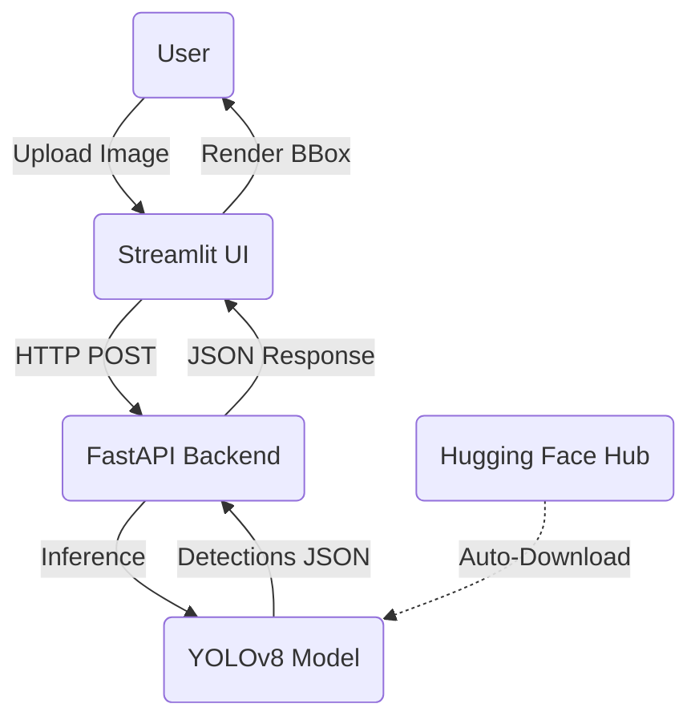

# Smart Traffic Vision 🚦

A production-ready end-to-end Computer Vision system for traffic object detection, built with FastAPI, Streamlit, and YOLOv8.

## Overview

This project detects objects in street images (e.g., cars, pedestrians, trucks, buses, motorcycles, bicycles, traffic lights, and stop signs). It acts as a portfolio-grade MLOps project that demonstrates clean architecture, model integration from Hugging Face Hub, a backend REST API, and a frontend UI.

## Architecture



## Features

- **FastAPI Backend**: Robust, scalable REST API for model inference.
- **Streamlit Frontend**: Professional and interactive UI for easy testing.
- **Hugging Face Hub**: Automatically downloads the optimal YOLOv8 model for traffic detection.
- **Clean Architecture**: Follows software engineering best practices (Dependency injection, schemas, single responsibility).
- **Dockerized**: Easy to deploy with a multi-service container.

## Installation & Running Locally

### 1. Without Docker (Virtual Environment)

```bash
# Create and activate virtual environment
python -m venv .venv
source .venv/bin/activate

# Install dependencies
pip install -r requirements.txt

# Start the Backend (in one terminal)
uvicorn app.main:app --reload --port 8000

# Start the Frontend (in another terminal)
export API_URL=http://localhost:8000/api/v1
streamlit run streamlit_app/app.py
```

### 2. With Docker

```bash
# Build the image
docker build -t smart-traffic-vision .

# Run the container mapping both ports
docker run -p 8000:8000 -p 8501:8501 smart-traffic-vision
```
Then visit `http://localhost:8501` to access the Streamlit UI, and `http://localhost:8000/docs` for the FastAPI swagger documentation.

## API Usage Example

**Health Check**
```bash
curl -X 'GET' 'http://localhost:8000/api/v1/health'
```

**Predict**
```bash
curl -X 'POST' \
  'http://localhost:8000/api/v1/predict' \
  -H 'accept: application/json' \
  -H 'Content-Type: multipart/form-data' \
  -F 'file=@path_to_your_image.jpg' \
  -F 'confidence_threshold=0.25'
```

## Deployment (Render)

This project is configured to deploy directly on Render using the provided `Dockerfile`. 
When deploying on Render, create a new **Web Service** using Docker. The entrypoint script (`entrypoint.sh`) will start both FastAPI and Streamlit concurrently. Ensure that Render maps to the correct port (usually exposing 8501 for the UI).

## Future Improvements

- Integrate an asynchronous task queue (e.g., Celery/Redis) for large batch processing.
- Add telemetry and request tracking (Prometheus, OpenTelemetry).
- Expand supported classes by fine-tuning on a larger traffic dataset.
